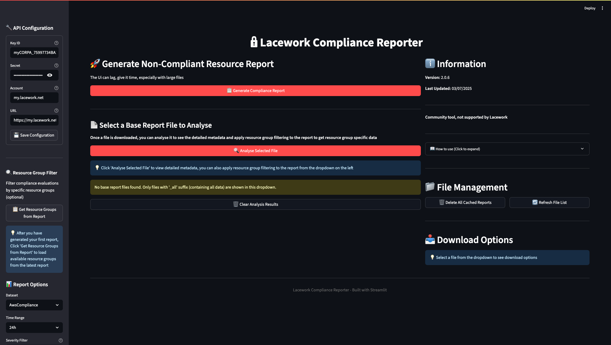
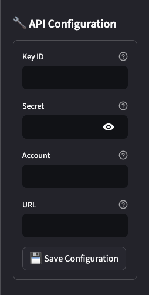

# 🔒 Lacework Compliance Reporter v2.0.23



A modern, web-based compliance reporting tool for Lacework that provides comprehensive analysis of compliance evaluations with resource group filtering capabilities.

## 🌟 Features

### **Core Functionality**
- **Non-Compliant Resource Focus**: Defaults to showing only non-compliant resources for better security insights
- **Multi-Cloud Support**: AWS, Azure, GCP, and Kubernetes compliance datasets
- **Resource Group Filtering**: Filter results by specific resource groups for targeted analysis
- **Multiple Download Formats**: JSON and CSV exports with file size information
- **Performance Optimized**: Cached file lists and optimized loading for better performance

### **User Interface**
- **Modern Web Interface**: Beautiful Streamlit-based UI with responsive design
- **Real-time Progress Tracking**: Visual progress indicators during report generation
- **File Management**: Browse, download, and manage recent reports
- **Manual Analysis**: Click "Analyse Selected File" to view detailed metadata and generate filtered downloads
- **Session Persistence**: Configuration and results saved between sessions

### **Analysis Capabilities**
- **Detailed Metadata**: View comprehensive report information including evaluation counts, time ranges, and filters applied
- **Resource Group Analysis**: Analyze which resource groups contain the most non-compliant resources
- **Filtered Downloads**: Generate resource group-specific reports in both JSON and CSV formats
- **File Size Information**: See file sizes for all download options

## 🚀 Quick Start

### Prerequisites
- Python 3.7 or higher
- Lacework API credentials (Key ID, Secret, Account, URL)
- Internet connection to access Lacework API

### Desktop Application (Recommended)
For the best user experience, use the Electron desktop application:

```bash
# Install Node.js dependencies (one-time setup)
cd electron
npm install

# Launch the desktop app
python launch_electron.py
```

### Web Application
For web-based access, run the Streamlit app directly:

### Installation

1. **Clone the repository**
   ```bash
   git clone https://github.com/J-C-B/lwpublic.git
   cd Lacework-Compliance-Reporter
   ```

2. **Set up a Python virtual environment**

   **macOS/Linux:**
   ```bash
   # Create virtual environment
   python3 -m venv venv
   
   # Activate virtual environment
   source venv/bin/activate
   
   # Verify activation (you should see (venv) in your prompt)
   which python
   ```

   **Windows:**
   ```bash
   # Create virtual environment
   python -m venv venv
   
   # Activate virtual environment
   venv\Scripts\activate
   
   # Verify activation (you should see (venv) in your prompt)
   where python
   ```

3. **Install dependencies**
   ```bash
   pip install -r requirements.txt
   ```

3. **Configure API credentials**
   
   **Option A: Use the web interface (Recommended)**
   - Run the application and configure credentials in the sidebar
   
   **Option B: Create config.json file**
   ```json
   {
     "keyId": "YOUR_API_KEY_ID",
     "secret": "YOUR_API_SECRET", 
     "account": "yourcompany.lacework.net",
     "url": "https://yourcompany.lacework.net"
   }
   ```

4. **Run the application**
   
   **Important**: Make sure your virtual environment is activated before running the app.
   
   **macOS/Linux:**
   ```bash
   source venv/bin/activate
   ```
   
   **Windows:**
   ```bash
   venv\Scripts\activate
   ```
   
   **Then run the application:**
   ```bash
   # Standard launch
   streamlit run streamlit_app.py
   
   # For large files (recommended for production)
   streamlit run streamlit_app.py --server.maxMessageSize 500
   ```

5. **Access the web interface**
   - Open your browser and navigate to `http://localhost:8501`

6. **When finished (optional)**
   
   **macOS/Linux:**
   ```bash
   deactivate
   ```
   
   **Windows:**
   ```bash
   deactivate
   ```

## 📖 How to Use

### 1. Configure API Credentials
Enter your Lacework API Key ID, Secret, Account, and URL in the sidebar, then click "💾 Save Configuration"




### 2. Generate Non-Compliant Report
- Select your dataset (AWS, Azure, GCP, or K8s)
- Choose time range (24h, 7d, 30d)
- Select severity levels (defaults to Critical and High)
- Click "📋 Generate Compliance Report"

### 3. Analyse and Filter Reports
- Select a report file from the dropdown
- Click "🔍 Analyse Selected File" to view detailed metadata and generate filtered downloads

### 4. Resource Group Filtering (Optional)
- Click "📋 Get Resource Groups from Report" to load available groups
- Select specific resource groups to filter analysis results
- Generate filtered downloads for selected resource groups

### 5. Download Options
Use the Download Options section to get JSON and CSV versions of your reports:
- **Base Report JSON**: Complete dataset in JSON format
- **Base Report CSV**: Complete dataset in CSV format
- **Filtered JSON/CSV**: Resource group-specific filtered data

## 🏗️ Architecture

### Core Components

#### `streamlit_app.py`
The main Streamlit web application providing:
- Modern web interface with responsive design
- File management and analysis capabilities
- Resource group filtering and download options
- Performance optimizations and caching

#### `electron/` (Desktop Application)
Electron wrapper providing:
- Native desktop application experience
- Professional loading screen and error handling
- Cross-platform compatibility (Windows, macOS, Linux)
- Automatic Streamlit server management
- Standard desktop application menu

#### `lacework_compliance_reporter.py`
Core compliance reporting engine providing:
- Lacework API integration
- Compliance data fetching and processing
- Report generation and filtering
- File export capabilities

### Key Functions

#### Report Generation
- **`generate_report()`**: Main report generation with progress tracking
- **`analyze_report()`**: Detailed analysis of compliance reports
- **`get_resource_groups_from_report()`**: Extract resource groups from reports

#### File Management
- **`create_csv_from_json()`**: Convert JSON reports to CSV format
- **`format_file_size()`**: Human-readable file size formatting
- **`generate_filtered_filename()`**: Create descriptive filenames for filtered reports

#### Data Processing
- **`filter_report_by_resource_groups()`**: Filter reports by selected resource groups
- **`get_download_link()`**: Generate download links for files

## 📊 Data Structure

### Compliance Report Format
```json
{
  "metadata": {
    "generated_at": "2025-07-03T22:12:53",
    "dataset": "AwsCompliance",
    "total_evaluations": 150,
    "filters_applied": {
      "status": "NonCompliant",
      "severity": ["Critical", "High"]
    }
  },
  "evaluations": [
    {
      "id": "eval_123",
      "status": "NonCompliant",
      "severity": "Critical",
      "resource": "arn:aws:ec2:us-east-1:123456789012:instance/i-1234567890abcdef0",
      "account": {
        "AccountId": "123456789012",
        "Account_Alias": "my-account"
      },
      "region": "us-east-1",
      "section": "EC2",
      "evalType": "Config",
      "reason": "Instance is not encrypted",
      "recommendation": "Enable encryption for the instance",
      "resourceGroups": [
        {
          "resourceGuid": "rg_123",
          "resourceName": "Production Servers",
          "resourceType": "AWS_EC2_INSTANCE"
        }
      ]
    }
  ]
}
```

## 🔧 Configuration

### API Configuration
The application supports two configuration methods:

#### Web Interface Configuration
- Configure credentials directly in the Streamlit sidebar
- Credentials are saved to `gui_config.json`
- Supports automatic loading from existing `config.json`

#### File-based Configuration
Create a `config.json` file in the project root:
```json
{
  "keyId": "YOUR_API_KEY_ID",
  "secret": "YOUR_API_SECRET",
  "account": "yourcompany.lacework.net",
  "url": "https://yourcompany.lacework.net"
}
```

### Report Options
- **Dataset**: AWS, Azure, GCP, or Kubernetes compliance
- **Time Range**: 24 hours, 7 days, or 30 days
- **Status Filter**: Defaults to NonCompliant (hidden in UI)
- **Severity Filter**: Critical, High, Medium, Low, Info (defaults to Critical and High)

## 📁 File Management

### Generated Files
- **Base Reports**: `compliance_report_YYYYMMDD_HHMMSS_all.json`
- **Filtered Reports**: `compliance_report_YYYYMMDD_HHMMSS_[resource_group].json`
- **CSV Exports**: Corresponding `.csv` files for all reports

### File Operations
- **Browse**: View recent reports with creation dates and file sizes
- **Download**: Download reports in JSON or CSV format
- **Analyse**: View detailed metadata and generate filtered downloads
- **Delete**: Remove old reports to free up space

## 🚨 Troubleshooting

### Common Issues

#### UI Performance
- **Issue**: UI lags with large files
- **Solution**: Give the application time to process large reports. The UI will become responsive once processing is complete.

#### Large File Loading Issues
- **Issue**: Streamlit fails to load or display large compliance reports
- **Solution**: Run Streamlit with increased message size limit:
  ```bash
  streamlit run streamlit_app.py --server.maxMessageSize 500
  ```
  This increases the maximum message size to 500MB to handle large compliance reports.

#### API Authentication
- **Issue**: "Failed to authenticate with Lacework API"
- **Solution**: Verify your API credentials are correct and have the necessary permissions.

#### No Data Found
- **Issue**: Reports show 0 evaluations
- **Solution**: Try widening your search criteria (different time ranges, severity levels, or status filters).

#### Resource Groups Not Loading
- **Issue**: "No resource groups found"
- **Solution**: Generate a report first, then click "Get Resource Groups from Report".

### Performance Tips
- Use appropriate time ranges to limit data size
- Clear old reports regularly using the File Management section
- Use resource group filtering to focus on specific environments
- Allow time for large reports to process

## 🔒 Security Considerations

### API Credentials
- Store credentials securely and never commit them to version control
- Use environment variables or secure credential management in production
- Rotate API keys regularly

### Data Handling
- Reports contain sensitive compliance information
- Download files to secure locations
- Clean up temporary files when no longer needed

## 📈 Performance Optimizations

### Caching
- File lists are cached for 30 seconds to improve performance
- Analysis results are cached per file to avoid reprocessing
- Session state persists configuration between page refreshes

### File Processing
- Optimized file size calculations
- Efficient CSV generation with helper functions
- Reduced redundant file system operations

## 🤝 Contributing

This is a community tool and not officially supported by Lacework. Contributions are welcome!

### Development Setup
1. Fork the repository
2. Create a feature branch
3. Make your changes
4. Test thoroughly
5. Submit a pull request

### Code Style
- Follow PEP 8 guidelines
- Add comments for complex logic
- Update documentation for new features

## 📄 License

This project is provided as-is for community use. Please ensure compliance with your organization's policies and Lacework's terms of service.

## 🆘 Support

### Community Support
- This is a community tool, not officially supported by Lacework
- Issues and questions can be raised in the project repository
- Check existing issues before creating new ones

### Lacework Support
- For Lacework API issues, contact Lacework support
- API documentation is available in the `api-docs.md` file

---

**Version**: 2.0.23  
**Last Updated**: 04/07/2025  
**Community tool, not supported by Lacework** 

**Project was 100% created with Cursor** 